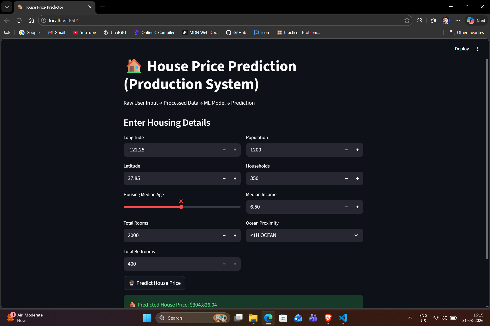

# 🏠 House Price Prediction using ETL & Machine Learning

#### 🖼️ Project Demo

### 🏠 House Price Prediction Web Interface

This is the production-ready UI where users input housing details and get real-time predictions.




## 📌 Project Overview

This project predicts house prices using a complete **ETL pipeline** and **Machine Learning model**.
It demonstrates real-world data engineering practices including **Bronze–Silver–Gold architecture**, data preprocessing, and model deployment.

---

## 🚀 Features

* 🔄 End-to-End ETL Pipeline (Extract → Transform → Load)
* 🧱 Medallion Architecture (Bronze, Silver, Gold layers)
* 🧹 Data Cleaning & Feature Engineering
* 🤖 Machine Learning Model for Price Prediction
* 📊 Ready for Dashboard / Analytics
* 🗄️ SQLite Database Integration

---

## 🏗️ Project Structure

```
housingadv/
│
├── app.py                  # Main application (UI / prediction)
├── main.py                 # ETL pipeline execution
├── app.ipynb               # Jupyter notebook (experiments)
├── requirements.txt        # Project dependencies
├── .gitignore              # Ignored files
│
├── data/                   # (ignored in Git)
├── models/                 # (ignored - .pkl files)
└── logs/                   # pipeline logs
```

---

## 🔄 ETL Pipeline

### 1️⃣ Extract

* Load raw dataset (`CSV`)
* Store initial data

### 2️⃣ Transform

* Handle missing values
* Encode categorical features
* Remove duplicates
* Feature engineering

### 3️⃣ Load

* Store processed data in SQLite database
* Prepare ML-ready dataset

---

## 🥇 Medallion Architecture

```
Bronze Layer → Raw Data  
Silver Layer → Cleaned Data  
Gold Layer → ML-ready + KPI Tables
```

---

## 🤖 Machine Learning

* Model: Regression Model (e.g., Linear Regression / Random Forest)
* Input: Processed housing features
* Output: Predicted house price

---

## 📊 KPIs (Gold Layer)

* Average House Price
* Price by Location
* Income vs Price Analysis
* Total Houses by Region

---

## ⚙️ Installation & Setup

### 1️⃣ Clone the repository

```bash
git clone https://github.com/Gaurav85218/house-price-prediction.git
cd house-price-prediction
```

### 2️⃣ Create virtual environment

```bash
python -m venv .venv
.venv\Scripts\activate
```

### 3️⃣ Install dependencies

```bash
pip install -r requirements.txt
```

---

## ▶️ Run the Project

### Run ETL Pipeline

```bash
python main.py
```

### Run Application

```bash
python app.py
```

---

## 📦 Dependencies

* pandas
* numpy
* scikit-learn
* sqlite3
* matplotlib

---

## ⚠️ Important Notes

* Large files like `.pkl`, `.csv`, `.db` are ignored using `.gitignore`
* Model file is not uploaded due to GitHub size limits

👉 You can retrain the model using the provided code.

---

## 📈 Future Improvements

* Deploy using FastAPI / Flask
* Add Streamlit UI
* Use cloud storage (AWS / GCP)
* Integrate real-time data pipeline

---

## 👨‍💻 Author

**Gaurav Kumar**

---

## ⭐ If you like this project

Give it a ⭐ on GitHub and share!
